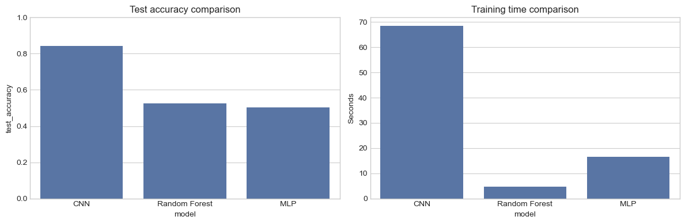
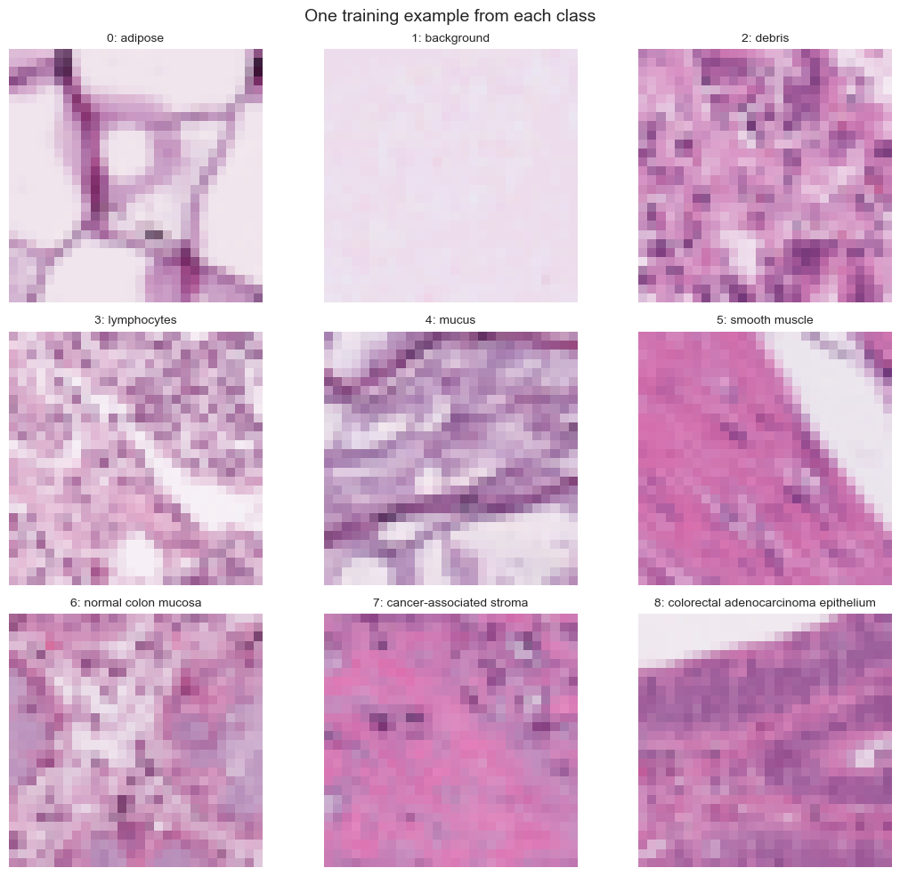

# PathMNIST Image Classification

An experimental comparison of a classical machine-learning baseline and two neural-network architectures for nine-class histopathology image classification.

> **Portfolio note:** This is a four-person university team project. I contributed to the Random Forest and MLP work, integrated the final experiment notebook, verified outputs against the report, and helped resolve implementation inconsistencies. The repository is a curated, public-facing version of the team submission; it is not presented as a solo project.

## Highlights

- **Task:** classify `28 × 28 × 3` PathMNIST histopathology image patches into nine tissue classes.
- **Models:** Random Forest baseline, fully connected MLP, and CNN.
- **Evaluation:** stratified validation for hyperparameter search; held-out test accuracy, macro F1, class-wise metrics, and confusion matrices.
- **Best model:** CNN with **84.16% test accuracy** and **0.8363 macro F1** on 8,000 held-out examples.

## Results

| Model | Input representation | Test accuracy | Macro F1 | Training time |
|---|---|---:|---:|---:|
| CNN | Normalised RGB images | **0.8416** | **0.8363** | 68.39 s |
| Random Forest | Flattened grayscale pixels | 0.5251 | 0.5023 | 4.77 s |
| MLP | Flattened normalised RGB pixels | 0.5038 | 0.4527 | 16.63 s |



The CNN's advantage is consistent with its spatial inductive bias: convolutional filters preserve local texture information, whereas the Random Forest and MLP work from flattened pixels.

## Dataset

The experiment uses the course-provided subset of [PathMNIST](https://medmnist.com/), a 2D histopathology image dataset from MedMNIST v2. The source data are **not included** in this repository. The original data are subject to the relevant dataset licence and course-distribution terms.



Classes: adipose, background, debris, lymphocytes, mucus, smooth muscle, normal colon mucosa, cancer-associated stroma, and colorectal adenocarcinoma epithelium.

## Approach

1. Load and inspect image tensors and class distributions.
2. Create model-specific inputs: normalised RGB tensors for neural networks and flattened grayscale pixels for the random forest.
3. Use a stratified validation split for lightweight hyperparameter searches.
4. Train selected final models independently from the tuning cells.
5. Compare accuracy, macro F1, per-class reports, confusion matrices, and training time on the test set.

The final CNN contains three convolution-plus-max-pooling blocks with 32, 64, and 128 filters, followed by a 128-unit dense layer and dropout. It was trained with Adam and sparse categorical cross-entropy.

## Reproducing the notebook

1. Create a Python environment and install dependencies:

   ```bash
   pip install -r requirements.txt
   ```

2. Place the authorised dataset files in `Assignment2Data/` beside the notebook:

   ```text
   Assignment2Data/
   ├── X_train.npy
   ├── X_test.npy
   ├── y_train.npy
   └── y_test.npy
   ```

3. Start Jupyter and run [`notebooks/pathmnist_model_comparison.ipynb`](notebooks/pathmnist_model_comparison.ipynb) from top to bottom.

The tuning cells can take appreciably longer than the final-model cells. Their outputs are retained for inspection.

## Continuous verification

GitHub Actions runs a fast [model smoke test](tests/smoke_test.py) on every push. It installs the project runtime and builds, trains for one epoch, and predicts with the Random Forest, MLP, and CNN on synthetic 28 × 28 RGB inputs. This validates the environment and end-to-end model paths without redistributing the course-provided dataset or misrepresenting synthetic-test results as the reported experiment metrics.

## Tech stack

Python · TensorFlow/Keras · scikit-learn · NumPy · pandas · Matplotlib · Seaborn

## Attribution

Dataset: J. Yang et al., *MedMNIST v2: A large-scale lightweight benchmark for 2D and 3D biomedical image classification*, Scientific Data, 2023. See [MedMNIST](https://medmnist.com/) for dataset details and licensing.

Please do not reuse this repository for assessed work. It is shared as a portfolio record and learning reference.
